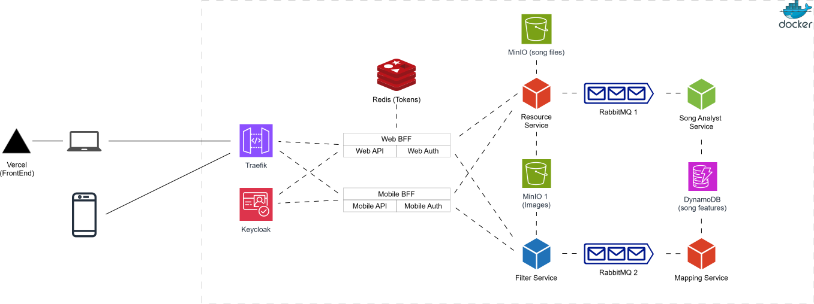

# 🎵 SoundTinter

A distributed microservice-based system that analyzes a song's vibe and
automatically applies a matching image filter to a user-provided photo.

The platform extracts musical attributes from an uploaded song, maps
them to a corresponding visual filter, applies the filter to the image,
and returns the processed result to the user.

------------------------------------------------------------------------

# 📌 Overview

This system allows users to:

1.  Upload a song
2.  Upload an image
3.  Automatically generate a photo filter that matches the song's mood
4.  Receive the filtered image

The system supports both Web and Mobile clients using the Backend for
Frontend (BFF) architectural pattern.

------------------------------------------------------------------------

# 🏗 System Architecture



------------------------------------------------------------------------

# 🧩 Core Components

## API Gateway -- Traefik

-   Reverse proxy
-   Load balancing
-   TLS termination

## Authentication -- Keycloak

-   OAuth2 / OpenID Connect
-   JWT-based authentication
-   Role-based access control

## Backend for Frontend (BFF)

Separate BFF layers for Web and Mobile clients to optimize API responses
and authentication flows.

------------------------------------------------------------------------

# 🛠 Microservices

## Resource Service

-   Accepts song and image uploads
-   Stores files in MinIO
-   Publishes processing events to RabbitMQ

## Song Analyst Service

-   Identifies song
-   Extracts musical features (tempo, energy, valence, mood) using Essentia library
-   Stores features in DynamoDB

## Mapping Service

-   Maps song features to filter type
-   Apply Decision Tree to match songs with filters

## Filter Service

-   Retrieves image
-   Applies filter (OpenCV)
-   Stores processed image
-   Returns result to client

------------------------------------------------------------------------

# 🗄 Storage Layer

-   MinIO (Song/Image)
-   DynamoDB (Song features)
-   Redis (Token/session management)

------------------------------------------------------------------------

# 📨 Messaging Layer

RabbitMQ enables asynchronous communication and loose coupling between
services.

------------------------------------------------------------------------

# 🚀 Running the Project

``` bash
git clone https://github.com/NKhang1234/SoundTinter.git
cd SoundTinter
docker-compose up --build
```

------------------------------------------------------------------------

# 📜 License

MIT License
